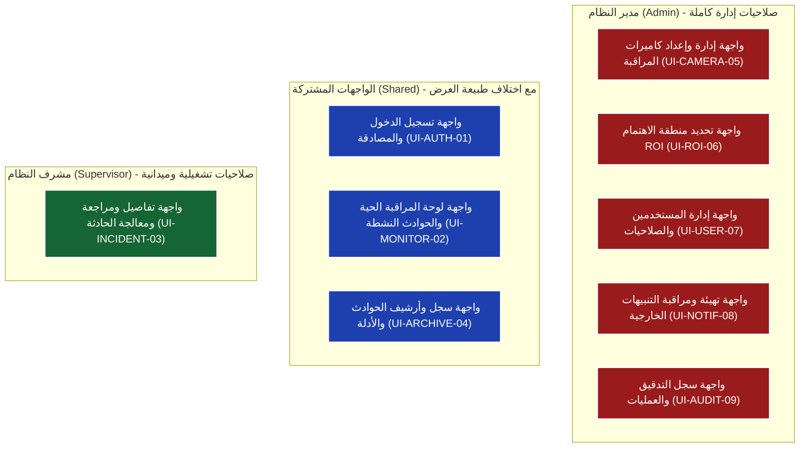

# التقرير الهندسي الشامل لواجهات ومكونات نظام الكشف المبكر عن الحرائق بالرؤية الحاسوبية

---

## 📌 مقدمة ومرجعية التحليل
تم إعداد هذا التقرير الفني الشامل استناداً إلى الوثائق الهندسية والمخططات الرسمية للنظام:
1. **المتطلبات الوظيفية للنظام (Functional Requirements - 3.4.1 إلى 3.4.14)**
2. **سيناريو العمل والتشغيل (Operational Scenario - المراحل من 1 إلى 10)**
3. **مخططات حالات الاستخدام (Use Case Diagrams - Picture 1 و Picture 2)**
4. **مخططات سير العمل والنشاط (Activity Diagrams - Picture 3 و Picture 4 و Picture 5 و Picture 6)**

تم تحليل الواجهات باعتبار المشروع **نظام ويب إنتاجي حقيقي متكامل (Enterprise Production Web Application)** مع توضيح الفروقات الجوهرية عن النماذج الأولية المبسطة (Prototypes)، وتوحيد مسميات الواجهات في كافة الأقسام لضمان الدقة والوضوح.

---

## 📑 أولاً: الفهرس الموحد لجميع واجهات النظام

| # | الاسم الموحد للواجهة | الرمز البرمجي | الدور المستهدف | المرجع الفني والتوثيقي |
|---|---|:---:|:---:|---|
| 1 | **واجهة تسجيل الدخول والمصادقة** | `UI-AUTH-01` | مشترك (Admin & Supervisor) | متطلب 3.4.14 / مرحلة 1 / Picture 1, 2, 3, 5 |
| 2 | **واجهة لوحة المراقبة الحية والحوادث النشطة** | `UI-MONITOR-02` | مشترك (بصلاحيات عرض مختلفة) | متطلب 3.4.2, 3.4.3, 3.4.9 / مرحلة 3, 7 / Picture 2, 4, 6 |
| 3 | **واجهة تفاصيل ومراجعة ومعالجة الحادثة** | `UI-INCIDENT-03` | مشرف النظام (Supervisor) ومدير النظام | متطلب 3.4.10 / مرحلة 7 / Picture 2, 5 |
| 4 | **واجهة سجل وأرشيف الحوادث والأدلة** | `UI-ARCHIVE-04` | مشرف النظام (Supervisor) ومدير النظام | متطلب 3.4.11 / مرحلة 10 / Picture 2, 5 |
| 5 | **واجهة إدارة وإعداد كاميرات المراقبة** | `UI-CAMERA-05` | مدير النظام (Admin) | متطلب 3.4.1, 3.4.3 / مرحلة 2 / Picture 1, 3 |
| 6 | **واجهة تحديد منطقة الاهتمام (ROI)** | `UI-ROI-06` | مدير النظام (Admin) | متطلب 3.4.4 / مرحلة 2 / Picture 1, 3, 4 |
| 7 | **واجهة إدارة المستخدمين والصلاحيات** | `UI-USER-07` | مدير النظام (Admin) | متطلب 3.4.14 / مرحلة 1 / Picture 1 |
| 8 | **واجهة تهيئة ومراقبة التنبيهات الخارجية** | `UI-NOTIF-08` | مدير النظام (Admin) | متطلب 3.4.12 / مرحلة 8 / Picture 6 |
| 9 | **واجهة سجل التدقيق والعمليات** | `UI-AUDIT-09` | مدير النظام (Admin) | متطلب 3.4.13 / مرحلة 9 / Picture 1, 5 |

---

## 🔍 ثانياً: المكونات التفصيلية لكل صفحة في النظام الحقيقي

---

### 1. واجهة تسجيل الدخول والمصادقة (`UI-AUTH-01`)
* **الهدف والوظيفة:** بوابة الوصول الآمن للنظام، التحقق من بيانات الاعتماد وتحديد دور المستخدم وصلاحياته وتوجيهه آلياً للوحة التحكم المناسبة.
* **مكونات الصفحة التفصيلية:**
  * **نموذج الاعتماد (Login Form):**
    * حقل إدخال اسم المستخدم / البريد الإلكتروني مع التحقق الميداني الفوري.
    * حقل كلمة المرور مع خاصية الإظهار/الإخفاء وحماية الإدخال.
    * زر تسجيل الدخول (Sign In) مع مؤشر تحميل غير متزامن (Loading Spinner).
  * **منطقة التنبيهات والأخطاء:**
    * رسالة خطأ واضحة عند عدم تطابق بيانات الاعتماد (`عرض رسالة خطاء` حسب Picture 3 & 5).
    * تنبيه انتهاء الجلسة أو الحساب المعطل.
  * **عناصر الأمان والامتثال:**
    * رموز حماية الطلبات ضد التزوير (CSRF Protection).
    * آلية قفل الحساب المؤقت عند تجاوز عدد المحاولات الخاطئة (Rate Limiting & Brute Force Prevention).
* **الفروقات عن البروتوتايب:**
  * توجيه ديناميكي مباشر ومحمي عبر السيرفر: يتم توجيه المشرف إلى `واجهة لوحة المراقبة الحية`، بينما يُوجه المدير إلى `واجهة إدارة وإعداد كاميرات المراقبة` أو اللوحة الإدارية.
  * توليد جلسات مشفرة آمنة (JWT / HttpOnly Secure Cookies) وتوثيق محاولة الدخول في سجل التدقيق فوراً.

---

### 2. واجهة لوحة المراقبة الحية والحوادث النشطة (`UI-MONITOR-02`)
* **الهدف والوظيفة:** لوحة العمليات المركزية لمتابعة البث الحي للكاميرات في الزمن الحقيقي، فحص الاتصال، واستعراض الحوادث المكتشفة وتنبيهات الأعطال.
* **مكونات الصفحة التفصيلية:**
  * **شريط المؤشرات الحية (Live System Status Bar):**
    * عداد الكاميرات الإجمالي والمتصلة (Online) والمنقطعة (Offline).
    * عداد الحوادث النشطة مصنفة حسب مستويات الخطورة (حرجة / متوسطة / منخفضة).
    * مؤشرات اتصال الإنترنت وشريحة الاتصال الخلوي (GSM Modem).
  * **شبكة مشغل البث المتعدد (Multi-Camera Live Stream Grid):**
    * مشغلات فيديو بتقنيات منخفضة التأخير (WebRTC / RTSP-over-WebSocket).
    * أدوات التحكم بعرض الشبكة (1x1, 2x2, 3x3, أو شاشة كاملة).
    * شارة الحالة اللحظية لكل كاميرا (شارة خضراء للبث النشط، شارة حمراء نابضة عند انقطاع البث).
    * أزرار إعادة الاتصال اليدوي بالبث.
  * **شريط الحوادث النشطة (Active Incidents Sidebar / Drawer):**
    * بطاقات الحوادث المكتشفة آنياً مرتبة بالأولوية والخطورة.
    * بيانات كل بطاقة: رقم الكاميرا، موقع الحادثة، وقت الاكتشاف، نوع الكشف (دخان / لهب)، ونسبة الثقة.
    * لقطة مصغرة (Snapshot) مدمج بها صندوق التحديد (Bounding Box) ومنطقة (ROI).
    * زر وصول سريع "مراجعة وتأكيد الحادثة" ينقل مباشرة إلى واجهة المراجعة.
  * **منظومة التنبيهات العائمة (Floating Alerts & Audio System):**
    * تنبيهات صوتية مميزة للحوادث المؤكدة وحالات الطوارئ.
    * شريط تنبيه أحمر عاجل عند انقطاع كاميرا (`عرض تنبيه انقطاع الكاميرا` حسب Picture 4).
    * إشعار تحذيري عائم عند انقطاع الإنترنت أثناء الإرسال (`عرض تنبيه انقطاع الإنترنت` حسب Picture 6).
* **الفروقات عن البروتوتايب:**
  * الربط مع خادم البث الحي ومحرك الذكاء الاصطناعي عبر قنوات WebSockets ثنائية الاتجاه لتحديث الإطارات والحوادث لحظياً دون إعادة تحميل الصفحة.
  * تطبيق خوارزمية منع التكرار (Incident De-duplication): في حال استمرار الكشف لنفس الحدث يتم تحديث بيانات الحادثة القائمة آلياً بدلاً من تكرار البطاقات.

---

### 3. واجهة تفاصيل ومراجعة ومعالجة الحادثة (`UI-INCIDENT-03`)
* **الهدف والوظيفة:** الواجهة الإجرائية المخصصة للمشرف لمراجعة أدلة الكشف بدقة، الإقرار بالحادثة، تحديث حالتها التشغيلية، أو تصنيفها كإنذار خاطئ مع توثيق السبب.
* **مكونات الصفحة التفصيلية:**
  * **بطاقة معلومات الحادثة (Incident Header Info):**
    * المعرف الفريد للحادثة (Incident ID)، التوقيت الزمني الدقيق بالثانية.
    * اسم الكاميرا والقسم، ومستوى الخطورة (شارة ملونة: High / Medium / Low).
    * الحالة الراهنة (جديدة، قيد المتابعة، مؤكدة، معالجة، إنذار خاطئ).
  * **معرض الأدلة المرئية وسلسلة التحقق (Evidence & Temporal Verification Gallery):**
    * صورة الكشف الأساسية عالية الدقة مع طبقة الذكاء الاصطناعي (AI Bounding Box + Confidence Score).
    * شريط التتابع الزمني للإطارات (Frame Sequence Timeline): يعرض صور الإطارات المتتالية التي تثبت استمرارية الدخان/اللهب والحركة الميدانية (حسب المتطلب 3.4.6).
    * أدوات تكبير وتدوير وتنزيل ملفات الأدلة.
  * **لوحة اتخاذ القرار وتحديث الحالة (Action & Decision Controls):**
    * **زر الإقرار بالحادثة (Acknowledge Incident):** لتأكيد استلام المشرف للبلاغ وبدء المعالجة.
    * **قائمة تحديث الحالة:** (قيد المتابعة الميدانية -> معالجة وإغلاق الحادثة).
    * **خيار تصنيف كإنذار خاطئ (Mark as False Alarm):** يفتح نموذجاً إجبارياً لإدخال سبب الرفض (غبار، انعكاس ضوء، صيانة).
  * **سجل العمليات الخاص بالحادثة (Incident Audit Trail):**
    * جدول زمني يوضح هوية المشرف الذي عاين الحادثة والإجراءات المتخذة وتوقيتها.
  * **رسائل الاستجابة:**
    * نافذة تأكيد نجاح التحديث (`عرض رسالة نجاح التحديث` حسب Picture 5).
* **الفروقات عن البروتوتايب:**
  * منع إغلاق الحادثة كإنذار خاطئ إلا بعد إدخال نص سبب الرفض والتحقق منه برمجياً.
  * الربط التلقائي بعملية أرشفة الحادثة وتسجيل اسم المشرف وتوقيت الإجراء في سجل التدقيق الأمني لحظة الضغط على حفظ.

---

### 4. واجهة سجل وأرشيف الحوادث والأدلة (`UI-ARCHIVE-04`)
* **الهدف والوظيفة:** قاعدة البيانات الأرشيفية للرجوع إلى كافة الحوادث التاريخية، البحث المتقدم، معاينة الأدلة المسجلة، واستخراج التقارير الرسمية.
* **مكونات الصفحة التفصيلية:**
  * **شريط الفلاتر والبحث المتقدم (Multi-Criteria Filter Bar):**
    * محدد النطاق الزمني (من تاريخ/وقت إلى تاريخ/وقت).
    * فلتر الكاميرات والمستودعات.
    * فلتر مستوى الخطورة (عالية، متوسطة، منخفضة).
    * فلتر الحالة (حوادث حقيقية معالجة / إنذارات خاطئة مرفوضة).
    * حقل بحث برقم الحادثة أو اسم المشرف المسؤول.
  * **جدول بيانات الحوادث المؤرشفة (Archive Data Grid):**
    * الأعمدة: [رقم الحادثة | وقت البداية | الكاميرا | الموقع | مستوى الخطورة | الحالة النهائية | هوية المشرف | خيارات المعاينة].
    * دعم الفرز والترقيم الصفحي (Server-Side Pagination).
  * **نافذة استعراض الأدلة السريعة (Quick Evidence Modal):**
    * تمكن من معاينة صور الأدلة وسبب الإغلاق دون مغادرة صفحة الأرشيف.
  * **أدوات التصدير:**
    * تصدير نتائج البحث إلى ملفات تقارير PDF رسمية أو جداول Excel / CSV.
* **الفروقات عن البروتوتايب:**
  * استرجاع السجلات عبر استعلامات قواعد بيانات مفهرسة وسريعة تدعم آلاف السجلات مع ضغط وتخزين الأدلة المرئية بكفاءة عالية.

---

### 5. واجهة إدارة وإعداد كاميرات المراقبة (`UI-CAMERA-05`)
* **الهدف والوظيفة:** الإدارة التقنية الشاملة لكافة مصادر الفيديو والكاميرات المرتبطة بالنظام، فحص الاتصال، وإدارة الإعدادات الفنية.
* **مكونات الصفحة التفصيلية:**
  * **جدول إدارة الكاميرات (Cameras Management Table):**
    * قائمة الكاميرات: [اسم الكاميرا | رابط البث RTSP / IP | المنفذ | الموقع بالمستودع | حالة الاتصال الحالية | حالة ضبط ROI | الإجراءات].
    * شارات الحالة التشغيلية الفورية (متصلة، منقطعة، جاري إعادة الاتصال).
  * **نموذج إضافة / تعديل كاميرا (Camera Config Form / Modal):**
    * حقول اسم الكاميرا والرمز التعريفي.
    * حقل مسار البث المباشر (RTSP Stream URL) أو مسار ملف الفيديو الاختباري.
    * بيانات الاعتماد (اسم المستخدم وكلمة المرور للكاميرا).
    * زر "اختبار الاتصال المباشر" (Test Connection) قبل الحفظ.
  * **أزرار العمليات والإجراءات:**
    * زر حفظ بيانات الكاميرا وتحديث حالتها (`حفظ بيانات الكاميرا` حسب Picture 3).
    * زر الانتقال المباشر لضبط منطقة الاهتمام (ROI).
    * زر حذف الكاميرا مع نافذة تأكيد تحذيرية لحماية النظام.
* **الفروقات عن البروتوتايب:**
  * خدمة خلفية مخصصة لمراقبة الاتصال (Background Watchdog) تقوم بمحاولات إعادة الاتصال التلقائي وتحديث الواجهة فور حدوث أي انقطاع.

---

### 6. واجهة تحديد منطقة الاهتمام (`UI-ROI-06`)
* **الهدف والوظيفة:** تمكين مدير النظام من رسم وتخصيص النطاق الجغرافي للمراقبة داخل إطار الكاميرا لاستبعاد المناطق المسببة للإنذارات الخاطئة كالنوافذ والمصابيح.
* **مكونات الصفحة التفصيلية:**
  * **مشغل كانفاس التفاعلي (Interactive ROI Canvas):**
    * عرض لقطة حية من الكاميرا بدقتها الكاملة.
    * طبقة رسم تفاعلية لرسم مضلعات حرة (Polygons) أو مربعات تحديد متعددة النقاط.
    * مقابض تحكم تفاعلية (Vertices) لسحب وتعديل زوايا ونقاط المنطقة بسهولة.
  * **شريط أدوات الرسم والضبط (ROI Toolbar):**
    * أزرار: [رسم منطقة جديدة | إضافة نقطة | حذف نقطة | تراجع | مسح كامل].
    * زر تفعيل قناع التعتيم (Invert Mask Preview) لتظليل المناطق المستبعدة والتأكد من صحة التحديد.
  * **أزرار الحفظ والتطبيق:**
    * زر "حفظ منطقة الاهتمام" (`حفظ منطقة الاهتمام` حسب Picture 3).
    * زر "إلغاء واستعادة التحديد السابق".
* **الفروقات عن البروتوتايب:**
  * تحويل النقاط المرسومة على الشاشة إلى إحداثيات نسبية معيارية (Normalized Coordinates) وإرسالها فوراً لمحرك الذكاء الاصطناعي لتطبيق قناع الكشف دون توقف البث.

---

### 7. واجهة إدارة المستخدمين والصلاحيات (`UI-USER-07`)
* **الهدف والوظيفة:** إدارة حسابات المستخدمين، تعيين الصلاحيات والأدوار، وإيقاف أو تفعيل الحسابات لضمان أمن النظام.
* **مكونات الصفحة التفصيلية:**
  * **جدول المستخدمين (User Directory Table):**
    * الأعمدة: [اسم المستخدم | الاسم الكامل | البريد الإلكتروني | رقم الهاتف | الدور (Admin / Supervisor) | حالة الحساب | آخر دخول | الإجراءات].
  * **نموذج إضافة / تعديل مستخدم (User Form Modal):**
    * حقول البيانات الشخصية ورقم الهاتف المعتمد لاستلام رسائل SMS.
    * حقل معرف تيليجرام (Telegram Chat ID) لربط الحساب بالإشعارات الفورية.
    * قائمة اختيار الدور (مدير نظام Admin / مشرف نظام Supervisor).
    * حقول كلمة المرور مع فحص قوة التشفير.
  * **أزرار العمليات:**
    * زر إضافة مستخدم جديد.
    * زر تعديل البيانات، إعادة تعيين كلمة المرور، أو تعطيل/حذف الحساب.
* **الفروقات عن البروتوتايب:**
  * تطبيق صارم لنظام التحكم بالوصول المبني على الدور (RBAC) وتشفير كلمات المرور في قاعدة البيانات.

---

### 8. واجهة تهيئة ومراقبة التنبيهات الخارجية (`UI-NOTIF-08`)
* **الهدف والوظيفة:** ضبط قنوات الإنذار المزدوجة (Telegram Bot & GSM Modem SMS)، فحص جاهزية التوصيل، وإدارة قوائم المستلمين للتنبيهات عالية الخطورة.
* **مكونات الصفحة التفصيلية:**
  * **لوحة تهيئة قناة تيليجرام (Telegram Bot Configuration):**
    * حقل إدخال رمز البوت (Bot Token) ومعرفات القنوات/المستخدمين.
    * زر "فحص اتصال البوت" (Test Connection).
  * **لوحة تهيئة المودم الخلوي (GSM Modem SMS Configuration):**
    * إعدادات المنفذ التسلسلي (COM Port / Serial Baud Rate).
    * مؤشر حالة اتصال المودم وجاهزية شريحة SIM وقوة الإشارة.
    * جدول أرقام الهواتف المعتمدة لاستلام التنبيهات العاجلة في حالات الخطورة العالية.
    * زر "إرسال رسالة SMS تجريبية".
  * **لوحة سجل تسليم التنبيهات الفورية (Delivery Status Monitor):**
    * جدول يعرض حالة إرسال الإشعارات: [الوقت | الحادثة | القناة | المستلم | حالة التسليم (نجاح / فشل) | سبب الفشل].
    * تنبيهات فشل الإرسال وانقطاع الإنترنت (`عرض رسالة فشل الإرسال` و `عرض حالة إرسال التنبيه` حسب Picture 6).
* **الفروقات عن البروتوتايب:**
  * معالجة سيناريو الإرسال الطارئ: إرسال SMS عبر وحدة GSM الخلوية آلياً عند تسجيل حادثة ذات خطورة عالية أو عند انقطاع الإنترنت، لضمان وصول الإنذار دون اتصال شبكي مع خوارزمية منع التكرار.

---

### 9. واجهة سجل التدقيق والعمليات (`UI-AUDIT-09`)
* **الهدف والوظيفة:** السجل الأمني الموحد لتوثيق جميع العمليات التشغيلية والإدارية ومتابعة الامتثال والمساءلة.
* **مكونات الصفحة التفصيلية:**
  * **شريط الفلاتر والبحث في السجل:**
    * تصفية حسب المستخدم، نوع العملية (تسجيل دخول، تعديل كاميرا، تأكيد حادثة، تصنيف إنذار خاطئ، إرسال إشعار)، والنطاق الزمني.
  * **جدول بيانات سجل التدقيق (Audit Trail Grid):**
    * الأعمدة: [رقم السجل | الطابع الزمني بالمللي ثانية | المستخدم | الدور | نوع العملية | تفاصيل الإجراء | عنوان IP].
  * **نافذة تفاصيل التغييرات (Payload Diff Modal):**
    * تعرض تفاصيل البيانات المعدلة قبل وبعد الإجراء.
  * **أدوات التصدير:**
    * تصدير السجل الأمني بصيغ مشفرة أو تقارير PDF غير قابلة للتعديل.
* **الفروقات عن البروتوتايب:**
  * تسجيل الأحداث آلياً من طبقة السيرفر الخلفية (Backend Middleware) مع ضمان عدم إمكانية تعديل أو حذف أي سجل من قبل أي مستخدم.

---

## 👥 ثالثاً: تقسيم الواجهات حسب الأدوار والصلاحيات

---

### جدول مقارنة الصلاحيات وتوزيع الواجهات بين الأدوار:

| الاسم الموحد للواجهة | الرمز البرمجي | مدير النظام (Admin) | مشرف النظام (Supervisor) | الفروقات والضوابط التشغيلية بين الدورين |
|---|:---:|:---:|:---:|---|
| **واجهة تسجيل الدخول والمصادقة** | `UI-AUTH-01` | **متاحة** | **متاحة** | التوجيه بعد التحقق: المشرف إلى لوحة المراقبة، المدير إلى الإدارة العامة للكاميرات. |
| **واجهة لوحة المراقبة الحية والحوادث النشطة** | `UI-MONITOR-02` | **متاحة** | **متاحة** | المدير يتابع المؤشرات الفنية لكامل النظام، والمشرف يركز على مراقبة البث والاستجابة الفورية للحوادث. |
| **واجهة تفاصيل ومراجعة ومعالجة الحادثة** | `UI-INCIDENT-03` | **متاحة (مراجعة)** | **متاحة (صلاحية إجرائية كاملة)** | المشرف هو المسؤول الميداني المباشر عن الإقرار بالحادثة وتحديث حالتها أو رفضها مع كتابة سبب الإنذار الخاطئ. |
| **واجهة سجل وأرشيف الحوادث والأدلة** | `UI-ARCHIVE-04` | **متاحة (عرض وتصدير)** | **متاحة (بحث واستعراض أدلة)** | كلاهما يستطيع البحث واستعراض الأدلة، مع صلاحية إضافية للمدير لتصدير التقارير الإحصائية. |
| **واجهة إدارة وإعداد كاميرات المراقبة** | `UI-CAMERA-05` | **متاحة حصرياً** | **محجوبة تماماً** | إضافة وتعديل وحذف الكاميرات محصورة بمدير النظام لمنع التلاعب بمصادر الفيديو. |
| **واجهة تحديد منطقة الاهتمام (ROI)** | `UI-ROI-06` | **متاحة حصرياً** | **محجوبة تماماً** | رسم وتعديل مناطق الكشف على الكاميرات من مهام مدير النظام التقنية الحصرية. |
| **واجهة إدارة المستخدمين والصلاحيات** | `UI-USER-07` | **متاحة حصرياً** | **محجوبة تماماً** | إنشاء الحسابات وتعيين الصلاحيات محصورة بمدير النظام. |
| **واجهة تهيئة ومراقبة التنبيهات الخارجية** | `UI-NOTIF-08` | **متاحة حصرياً** | **محجوبة تماماً** | إدخال رمز بوت تيليجرام وضبط منفذ المودم وأرقام الهواتف محصورة بمدير النظام. |
| **واجهة سجل التدقيق والعمليات** | `UI-AUDIT-09` | **متاحة حصرياً** | **محجوبة تماماً** | متابعة أنشطة المستخدمين وسجل العمليات محصورة بمدير النظام لأغراض الرقابة والمساءلة. |

---

## 🎯 رابعاً: مصفوفة المطابقة والتحقق مع المخططات والمتطلبات

1. **المصادقة وإدارة الجلسات:** متطلب `3.4.14`، مرحلة `1`، مخططات `Picture 1, 2, 3, 5` $\rightarrow$ مطبقة في `UI-AUTH-01`.
2. **إدارة الكاميرات وضبط مصادر البث:** متطلب `3.4.1`، مرحلة `2`، مخططات `Picture 1, 3` $\rightarrow$ مطبقة في `UI-CAMERA-05`.
3. **رسم وتحديد منطقة الاهتمام (ROI):** متطلب `3.4.4`، مرحلة `2`، مخططات `Picture 1, 3, 4` $\rightarrow$ مطبقة في `UI-ROI-06`.
4. **المراقبة الحية وتنبيهات انقطاع الاتصال:** متطلبات `3.4.2, 3.4.3, 3.4.9`، مراحل `3, 7`، مخططات `Picture 2, 4` $\rightarrow$ مطبقة في `UI-MONITOR-02`.
5. **مراجعة الحادثة وسلسلة التحقق وتوثيق الإنذار الخاطئ:** متطلب `3.4.10`، مرحلة `7`، مخططات `Picture 2, 5` $\rightarrow$ مطبقة في `UI-INCIDENT-03`.
6. **الأرشيف الرقمي للحوادث والبحث والتصفية:** متطلب `3.4.11`، مرحلة `10`، مخططات `Picture 2, 5` $\rightarrow$ مطبقة في `UI-ARCHIVE-04`.
7. **إعداد ومراقبة التنبيهات الخارجية (Telegram & GSM SMS):** متطلب `3.4.12`، مرحلة `8`، مخططات `Picture 2, 6` $\rightarrow$ مطبقة في `UI-NOTIF-08`.
8. **سجل التدقيق والعمليات الأمني:** متطلب `3.4.13`، مرحلة `9`، مخططات `Picture 1, 5` $\rightarrow$ مطبقة في `UI-AUDIT-09`.
9. **إدارة حسابات المستخدمين وتوزيع الصلاحيات:** متطلب `3.4.14`، مرحلة `1`، مخطط `Picture 1` $\rightarrow$ مطبقة في `UI-USER-07`.
